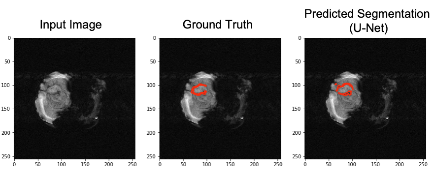

# CART-segmentation

## Workflow Description

1. Load and preprocess MRI images and corresponding masks for training and validation.
2. Build a U-Net model for segmentation, leveraging convolutional and upsampling layers.
3. Train the model using dice coefficient as a metric, with early stopping and model checkpointing.
4. Generate predictions on test images and visualize the segmentation results with ground truth comparisons.
